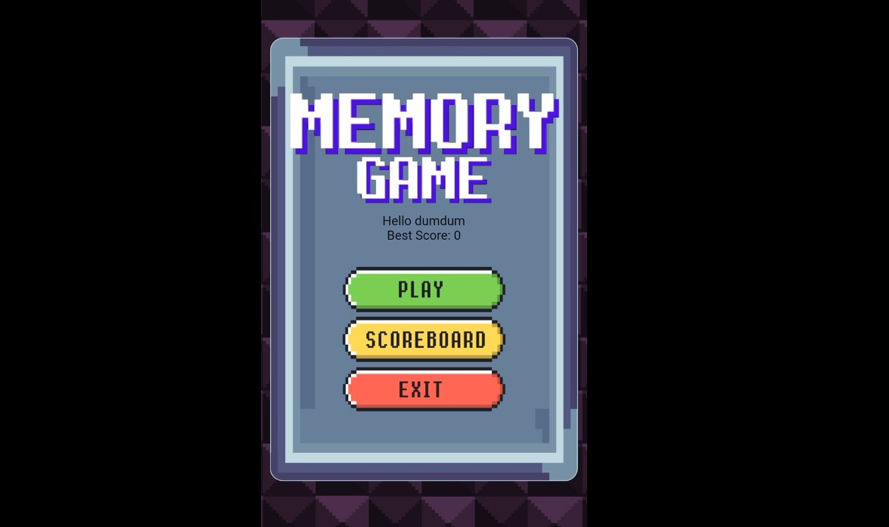
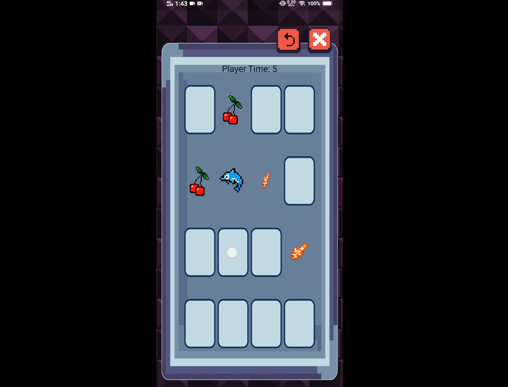

# DumDum Card Game

DumDum Card Game is a mobile game developed in Flutter. This mini project is dedicated for me to fully learn and understand Flutter.

Android installer v2 -> https://github.com/DevDumDum/DumDumCardGame/releases/download/Experimental-v2/v2.1.0.apk

Features:
<ul>
  <li>Main card game mechanics ( flip card, end game when solved ).</li>
  <li>In-game timer.</li>
  <li>Storing data on local device</li>
    <ul>
      <li>Username</li>
      <li>Best Time</li>
      <li>Number of Pairs</li>
      <li>Number of Moves</li>
    </ul>
</ul>

## *DumDumCard v2 updates*

Changes:
<ul>
  <li>Game code refactored for accessing variables.</li>
  <li>Additional data stored at the device locally for high scores (numbers of moves, pairs, time).</li>
</ul

Added Features:
<ul>
  <li>card game timer.</li>
</ul>

Coming Soon
<ul>
  <li>game mode: timer-based ( unlimited sets of cards spawn )</li>
  <li>Online Leaderboard</li>
  <li>Personal user account ( for online leaderboard )</li>
</ul>

Game Video Demo v1 -> https://drive.google.com/file/d/1tgBWUbkVrYhjz4g66BcxhmMnKyH7huI1/view?usp=sharing

Latest Release Notes -> https://github.com/DevDumDum/DumDumCardGame/releases/tag/Experimental-v2
